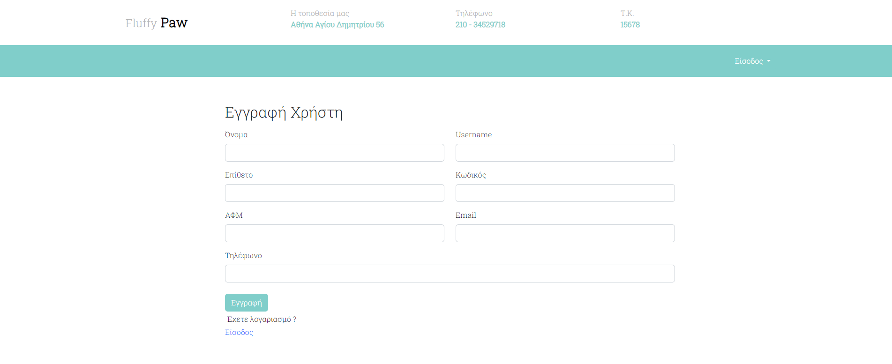
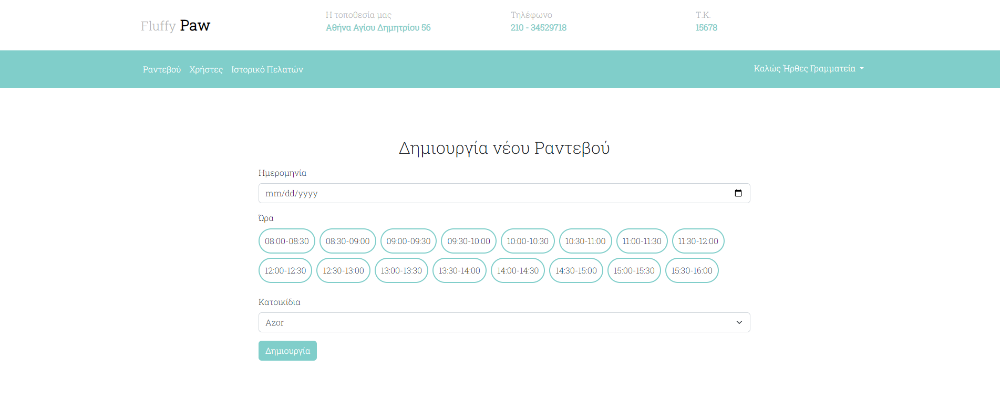
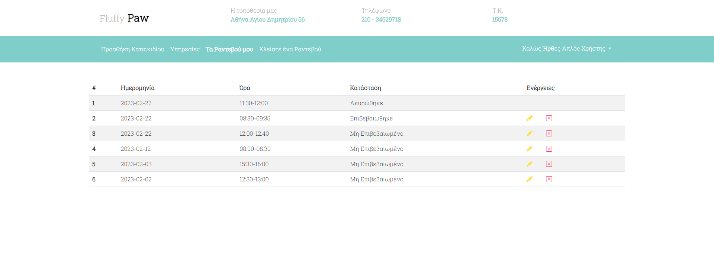
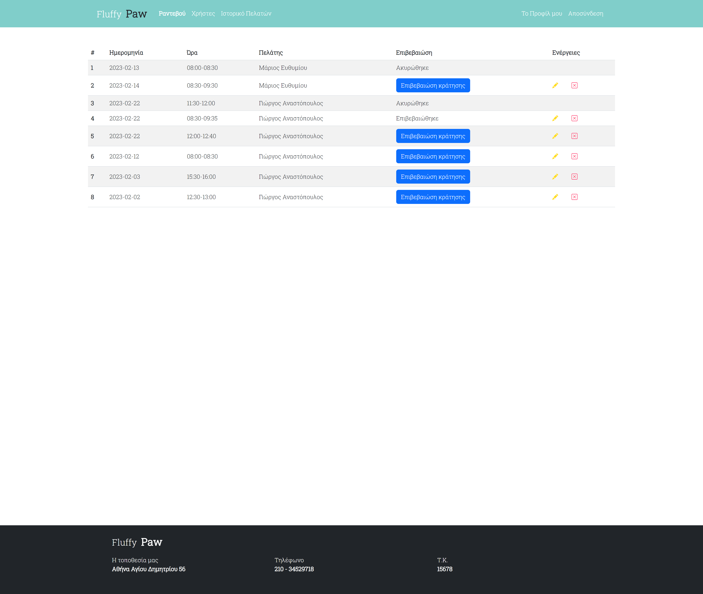
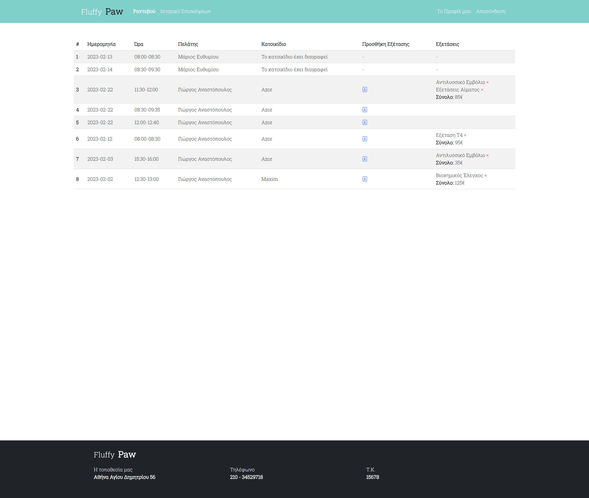

<h2>Vetclinic is a website that allows registered users to book appointments with a vet clinic. Implements 3 user roles, the roles of user, secretary and doctor, each with their own set of privileges and accesses. Technologies used: Laravel, Html, Bootstrap, Jquery, Javascript, Php Sql.</h2>

<h3>Homepage</h3>

<h3>Registration</h3>

<h3>Create an appointment</h3>

<h3>User can see their upcoming appointments</h3>

<h3>Secretary role can confirm, edit or delete appointments</h3>

<h3>Doctor role can check their upcoming appointments and insert a pet examination if needed.</h3>

